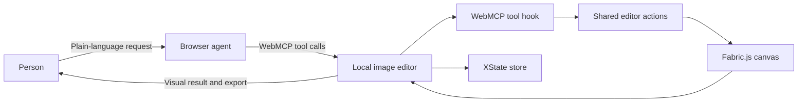

# Image Editor for Humans and Browser Agents

A local-first image editor where humans and browser agents collaborate through WebMCP. Editing state, transformations, and exports run in the browser while people and agents add, style, and position edits.

## WebMCP tools

| Tool                                   | Purpose                                                   |
| -------------------------------------- | --------------------------------------------------------- |
| `image_editor_get_status`              | Read image, mode, and zoom status                         |
| `image_editor_upload`                  | Upload an image URL or base64-encoded data URL            |
| `image_editor_list_objects`            | Inspect editable objects and coordinates                  |
| `image_editor_select_object`           | Select an object by ID                                    |
| `image_editor_add_text`                | Add editable text                                         |
| `image_editor_add_shape`               | Add a rectangle or circle                                 |
| `image_editor_add_blur`                | Add and optionally place/size a blur region               |
| `image_editor_toggle_drawing`          | Toggle interactive free drawing                           |
| `image_editor_draw_stroke`             | Draw an editable stroke from image coordinates            |
| `image_editor_draw_arrow`              | Draw an editable arrow from image coordinates             |
| `image_editor_move_selected`           | Move selected object by visual top-left image coordinates |
| `image_editor_rotate_selected`         | Rotate the selected object                                |
| `image_editor_resize_selected`         | Resize selected object in image pixels                    |
| `image_editor_set_color`               | Set object or active drawing color                        |
| `image_editor_set_stroke_width`        | Set stroke width                                          |
| `image_editor_bold_selected_text`      | Make selected text bold                                   |
| `image_editor_italicize_selected_text` | Italicize selected text                                   |
| `image_editor_crop`                    | Start, apply, or cancel cropping                          |
| `image_editor_history`                 | Undo or redo an edit                                      |
| `image_editor_zoom`                    | Zoom in, out, or reset                                    |
| `image_editor_delete_selected`         | Delete the selected object                                |
| `image_editor_clear_all`               | Remove all editable objects                               |
| `image_editor_export`                  | Export the canvas as a PNG download                       |

Positions, drawing points, and dimensions use image-local coordinates and image pixels, not browser-page or editor-canvas coordinates. Object positions and dimensions describe the visual bounding box, so text objects with centered Fabric origins are reported consistently. The image-local origin is the photo's top-left corner. `image_editor_get_status` returns the image's canvas origin and scale when the photo is fitted inside the editor.

## High-level architecture



WebMCP registration lives in `src/webmcp/use-image-editor-tools.ts`. Shared canvas mutations live in `src/editor/editor-actions.ts`, application state lives in `src/editor/editor-store.ts`, and the toolbar/editor presentation is split into components under `src/components/editor/`.

## Run locally

```bash
pnpm install
pnpm dev
```

Create a production build with:

```bash
pnpm build
```

## Why this is a strong fit for WebMCP

Image editing is naturally multi-step: add an object, select it, style it, position it, adjust it, and export it. These steps are easy for a person but awkward for an agent when the only interface is a visual canvas. WebMCP exposes the editor's real actions as structured browser tools, so an agent can work with the page instead of guessing at clicks and coordinates. Because the editor is local-first, editing does not require a remote image-processing backend.

## How it creates a better experience

People can describe the outcome in plain language while the agent handles the sequence of edits. The person remains in control of the visual result, and the agent can use object IDs, image-local coordinates, and status checks to make precise changes. Edits feel fast and private because they run locally in the browser, making tasks such as privacy redaction, visual callouts, and social-media annotations possible in one turn.

## What people and agents can do together

For example:

> Add a blur over the face, draw a red arrow toward the product, add a bold title in the top-left, move it to a precise position, and export the image.

The agent can inspect what is on the canvas, select the right object, make targeted edits, and confirm completion. Before WebMCP, that workflow required manually finding controls and dragging objects through several separate interactions.

## How WebMCP is implemented

The page registers structured tools with WebMCP. Tool calls delegate to shared editor actions backed by Fabric.js, while the XState store holds serializable application state such as the image URL, active color, and stroke width. All editing and export work happens in the browser; no editing backend is required. The same editor actions are used by the toolbar and agent tools, so human and agent edits behave consistently.

## What's next

We plan to add local-first object recognition with MediaPipe, allowing the editor to detect faces, products, and other subjects directly in the browser. This would bring subject detection into the same private, local execution model as editing and export.
